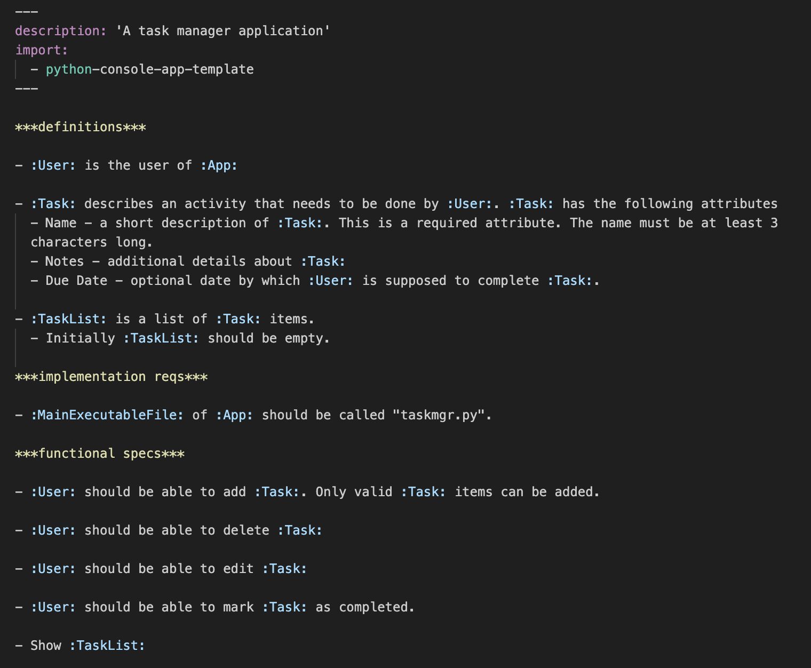

# *codeplain renderer

## What is \*codeplain?

\*codeplain platform makes coding agents better by having them write and maintain specifications instead of code. It extends coding agents with agentic skills for working at the specification layer, and with tools that convert specifications into tested and validated implementation code.

This repository is the renderer that powers that last step, turning \*\*\*plain specs into software using the *codeplain API.

The result is a software development workflow centered on specifications, which are faster and more efficient for AI to produce and easier for developers to review and maintain than raw code.

Schematic overview of the *codeplain's code rendering:


## Getting started

Get started in 15 minutes.

### 1. Install \*codeplain in the terminal

macOS and Linux:

```bash
curl -fsSL https://codeplain.ai/install.sh | bash
```

Windows PowerShell:

```powershell
irm https://codeplain.ai/install.ps1 | iex
```

**Windows users:** Please install WSL (Windows Subsystem for Linux) as this is currently the supported environment for running plain code on Windows.

Follow the installation instructions to complete setup. The installer installs the `codeplain` CLI, walks you through setting your `CODEPLAIN_API_KEY`, and offers to set up [plain-forge](#2-let-your-agent-work-in-specs-not-code) and the [plyn editor extension](#vs-code--cursor-extension) for you in the same session.

If you'd rather not run the installer, sign up at [platform.codeplain.ai](https://platform.codeplain.ai) to get your API key and export it yourself:

```bash
export CODEPLAIN_API_KEY="your_actual_api_key_here"
```

### 2. Let your agent work in specs, not code

You describe what you want in plain English, an agent helps you write a spec in \*\*\*plain language, and \*codeplain renders the actual code. This is what [plain-forge](https://github.com/Codeplain-ai/plain-forge) sets up: a toolkit of skills, rules, and docs that plugs into your AI coding agent of choice — Claude Code, Codex, ForgeCode, OpenCode, or any other agent that reads from a standard skills directory — and turns a conversation into a complete `.plain` spec, then keeps maintaining it across the lifetime of the project.

If you didn't install it during step 1, run it any time:

```bash
npx plain-forge install
```

### 3. Convert specs into tested and validated code

\*codeplain extends coding agents with agentic skills for working at the specification layer, and with tools that convert specifications into tested and validated implementation code.

```bash
codeplain your-project.plain
```

### Try it now

You can immediately test the system with a simple "Hello World" example:

- Change to the example folder and run the example:

  ```bash
  cd examples/example_hello_world_python
  codeplain hello_world_python.plain
  ```

  _Note: Rendering will take a few minutes to complete._

- The system will generate a Python application in the `build` directory. You can run it with:
  ```bash
  cd build
  python hello_world.py
  ```

### VS Code / Cursor extension

If you're using Visual Studio Code or Cursor IDE, we also recommend installing the [plyn extension](https://marketplace.visualstudio.com/items?itemName=Codeplain.plyn) for `***plain` syntax highlighting. The installer in step 1 offers to install it automatically if it detects `code` or `cursor` on your `PATH`.

### Community and support

Share what you're building! Join the [\*codeplain Discord](https://discord.gg/cgbynb9hFq) if you have questions, ideas, or want to share what you built.

Hit an edge case or have feedback? Reach us at [support@codeplain.ai](mailto:support@codeplain.ai).

## Abstracting Away Code Generation Complexity with \*\*\*plain

\*\*\*plain is the language of spec-driven development — a specification language that combines the efficiency of natural language with the control and precision of code.

Structured sections for definitions, functional specs, implementation requirements, test requirements, and acceptance tests let your specs (not scattered docs or ad hoc prompts) become the source of truth for your software's behavior, abstracting away the complexity of using large language models for code generation.

Specs are plain text, so they fit into the workflows you already use — version control, pull requests, and code review.

See the [\*\*\*plain language guide](https://www.plainlang.org/docs/language-guide/) to learn the full syntax.

An example application in \*\*\*plain



## Additional Resources

### Examples and Sample Projects

- See the [examples](examples) folder for sample projects in Golang, Python, React, and Flutter.
- For an example of how to implement Pong in \*\*\*plain, see the [pong](https://github.com/Codeplain-ai/plainlang-examples/tree/main/pong) example.
- For an example of how to implement a task manager in \*\*\*plain, see the [task-manager](https://github.com/Codeplain-ai/plainlang-examples/tree/main/task-manager) example.

### Documentation

- For more details on the ***plain format, see the [***plain language specification](https://www.plainlang.org/docs/).
